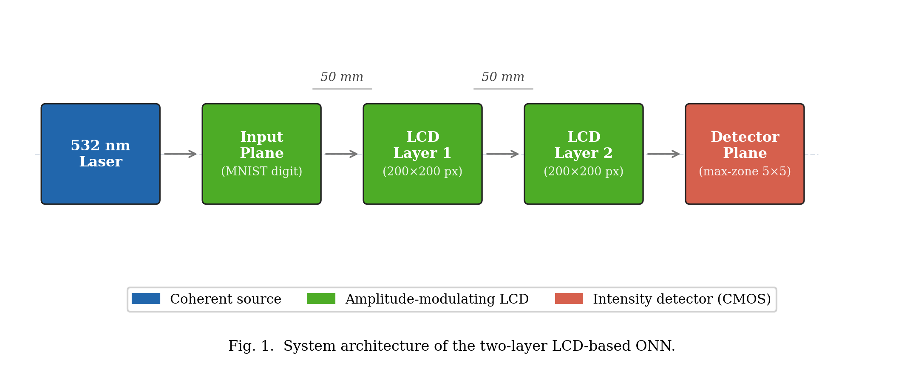
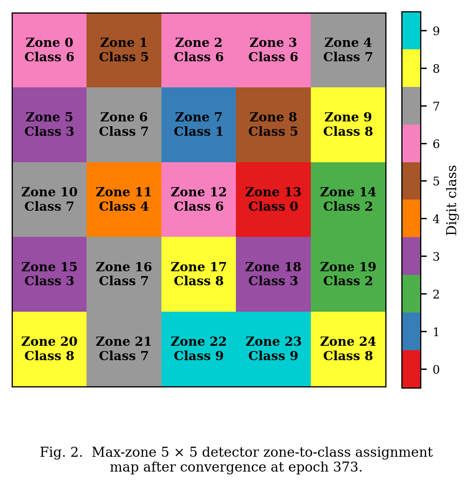

# 3. Methodology

This section describes the simulation methodology. The forward-pass physics model and all trainable components were implemented in PyTorch [11], enabling automatic differentiation through the wave propagation steps. §3.1 specifies the optical hardware and system architecture. The propagation model and its justification relative to the Fresnel approximation are presented in §3.2. §3.3 covers the amplitude modulation scheme and LCD selection rationale. §3.4 discusses the two-layer diffractive design. §3.5 describes the five detection architectures evaluated in this work. §3.6 details the training procedure, including the optimiser configuration, learning rate schedule, loss function, and hyperparameter choices.

## 3.1 System Architecture

The physical ONN is implemented as a linear optical train comprising four principal elements: a coherent illumination source, an input display for the MNIST digit, two amplitude-modulating LCD layers, and a camera detector at the output plane. Light passes sequentially through each element, and classification is performed by reading the output intensity distribution. Fig. 1 illustrates the system layout.

**Fig. 1.**  System architecture of the two-layer LCD-based ONN.

The figure shows the sequential optical train: the coherent laser source on the left illuminates the first LCD, the transmitted amplitude field propagates freely across the 50 mm gap to the second LCD, and the modulated output field propagates to the camera detector on the right where zone intensities are read out for classification.

The hardware specifications of the system are summarised in Table 2.

**Table 2: Hardware specifications of the LCD optical system.**

| Parameter | Value |
|-----------|-------|
| Laser wavelength | 532 nm |
| LCD resolution | 200 × 200 pixels |
| LCD active area | 27.66 mm × 27.66 mm |
| Pixel pitch | 138.3 µm |
| Number of amplitude layers | 2 |
| Inter-layer spacing | 50 mm |
| LCD type | Monochrome transmissive |

## 3.2 Light Propagation Model

### 3.2.1 Angular Spectrum Method

The propagation of a monochromatic coherent optical field between adjacent LCD layers is computed using the Angular Spectrum Method (ASM) [9]. The method decomposes the input field U(x, y) into its plane-wave components via a two-dimensional Fourier transform, propagates each component independently, and reconstructs the output field by an inverse Fourier transform. The propagation transfer function is:

$$H(k_x, k_y) = \exp\left(j z \sqrt{k^2 - k_x^2 - k_y^2}\right), \quad k_x^2 + k_y^2 \leq k^2 \qquad (1)$$

where k = 2π/λ is the free-space wavenumber, k_x and k_y are the transverse wavenumber components, and z is the propagation distance. Evanescent components, for which k_x² + k_y² > k², contribute no propagating energy over the 50 mm span and are set to zero. Physically, these evanescent modes correspond to spatial frequencies beyond the optical bandwidth of free space — any features in the mask finer than one wavelength cannot propagate to the detector and cannot contribute to classification. Filtering evanescent modes also prevents numerical instability: without filtering, these components grow exponentially with propagation distance in the formula above and would produce unbounded field amplitudes in simulation.

The discrete implementation maps directly onto the two-dimensional Fast Fourier Transform (FFT). For a grid of N × N pixels with pixel pitch Δx, the discrete spatial frequencies are:

$$f_x[m] = \frac{m - \lfloor N/2 \rfloor}{N \Delta x}, \quad m = 0, 1, \ldots, N-1 \qquad (2)$$

and equivalently for f_y. With N = 200 and Δx = 138.3 µm, the maximum representable spatial frequency is f_max = 1/(2Δx) = 3617 m⁻¹, corresponding to a maximum diffraction half-angle of θ_max = arcsin(λ·f_max) = arcsin(0.00193) ≈ 0.11°. In the paraxial limit (θ ≪ 1) this corresponds to the Nyquist-limited angular bandwidth of the pixel aperture. The sampling criterion requires that the inter-layer spacing z ≤ Δx²/λ = (138.3 × 10⁻⁶)² / (532 × 10⁻⁹) = 35.9 m, which is vastly satisfied at z = 50 mm, confirming that aliasing is not a concern. The resulting discretised procedure applies two FFTs per propagation step, making ASM computationally efficient on a GPU.

### 3.2.2 Justification for ASM

Table 3 compares the ASM with the Fresnel integral, the principal alternative near-field propagation model.

**Table 3: Comparison of light propagation simulation methods.**

| Method | Near-field valid | Accuracy | Computational cost |
|--------|-----------------|----------|--------------------|
| Fresnel integral | No | Approximate | One FFT |
| Angular Spectrum Method | Yes | Exact (scalar wave) | Two FFTs |

The Fresnel approximation introduces phase errors when the propagation angle exceeds approximately 30°. Although all propagating spatial frequencies in the present geometry lie well within this limit (θ_max ≈ 0.11° as derived above), ASM is nonetheless preferred as it is exact within the scalar diffraction approximation at any propagation distance and angle [9]. The additional computational cost of one extra FFT per layer is negligible on a GPU.

## 3.3 Amplitude Modulation and LCD Selection

### 3.3.1 Modulation Scheme

Each layer modulates the amplitude of the incoming field:

$$U_\text{out}(x, y) = U_\text{in}(x, y) \cdot T(x, y) \qquad (3)$$

where T(x, y) ∈ [0, 1] is the pixel transmission, constituting the learnable parameters optimised by backpropagation.

### 3.3.2 Justification for LCD Over Alternative Technologies

Several competing spatial light modulator (SLM) technologies were evaluated, as summarised in Table 4.

**Table 4: Comparison of spatial light modulator technologies.**

| Technology | Modulation | Cost (per unit) | Programmable | Selected |
|-----------|-----------|----------------|-------------|---------|
| 3D-printed phase mask | Phase | < USD 10 | No | No |
| Digital Micromirror Device | Amplitude (binary only) | > USD 5,000 | Yes | No |
| Phase SLM (LCOS) | Phase | > USD 10,000 | Yes | No |
| Monochrome LCD | Amplitude (continuous) | < USD 50 | Yes | Yes |

Monochrome LCD was selected for cost (at least two orders of magnitude below any programmable alternative), electronic programmability without disturbing optical alignment, and commercial availability at the required resolution. Phase SLMs and DMDs were rejected on cost and optical incompatibility grounds respectively.

On a cost-effectiveness basis, the two-layer LCD system achieves 90.85% classification accuracy at a total component cost below USD 100 for both modulating layers — a cost per percentage point of accuracy that is at least two orders of magnitude lower than any programmable phase-SLM alternative. All components are available off-the-shelf and require no custom fabrication, making the design immediately reproducible in any optics laboratory.

### 3.3.3 LCD Non-Idealities

**Fill factor.** A real LCD pixel has dead areas at its borders. Only the central fraction F of each pixel area transmits the modulated amplitude; the remaining (1−F) border region is opaque. This is implemented as a per-pixel aperture mask:

$$T_\text{eff}(x,y) = T(x,y) \cdot \mathrm{ff}(x,y), \quad \mathrm{ff}(x,y) = \begin{cases} 1 & \text{if } (x/\Delta x) \bmod 1 \in [(1-F)/2,\,(1+F)/2] \\ 0 & \text{otherwise} \end{cases} \qquad (4)$$

where Δx is the pixel pitch and the condition applies identically in both spatial dimensions.

**Contrast limits.** Real LCDs cannot achieve zero transmission in the dark state or unity in the bright state. The achievable range [T_min, T_max] is enforced by a linear rescaling:

$$T_\text{clipped}(x,y) = T_\min + T(x,y)\,(T_\max - T_\min) \qquad (5)$$

**Binary quantisation.** LCDs that support only on/off switching are modelled by a step function at threshold θ = 0.5. During training, a straight-through estimator (STE) passes the hard binary decision in the forward pass while propagating gradients through the continuous amplitude in the backward pass:

$$T_\text{binary} = \mathbf{1}[T \geq \theta] + \underbrace{T - T.\mathrm{detach()}}_\text{gradient path only} \qquad (6)$$

For the present simulation runs, the LCD is treated as continuous-amplitude and full-contrast (F = 1, T_min = 0, T_max = 1, binary disabled), establishing an upper-bound accuracy baseline. The framework activates these constraints when physical characterisation data are available. Three idealising assumptions bound the scope of the simulation results: perfect spatial coherence of the illumination, zero LCD phase cross-talk between pixels, and perfect inter-layer alignment; departures from these conditions in the physical hardware prototype will reduce accuracy below the simulated figure, and quantifying them is identified as a priority in Section 6.

## 3.4 Multi-Layer Diffractive Design

A single amplitude layer performs element-wise multiplication with no spatial mixing; it can scale the intensity at each pixel independently but cannot route energy from one region of the field to another. The free-space propagation step between two modulating layers introduces diffraction-based spatial frequency mixing: the Fourier components of the modulated field spread across the aperture and interfere constructively or destructively at the next layer, realising a coupled spatial transformation. Two propagation steps prove sufficient for MNIST digit classification, as demonstrated by the 90.85% test accuracy achieved in this work: the digits differ primarily in low-to-mid spatial frequency content that two rounds of amplitude modulation and diffraction mixing can separate. The representational capacity of two layers is nevertheless limited compared to five-layer published D²NNs [7]; the 0.9 percentage point accuracy gap relative to the Lin et al. benchmark is likely attributable primarily to this depth difference.

The choice of two layers was driven by the hardware budget: each additional LCD layer adds one alignment-sensitive propagation gap and one additional USD 50 component, and alignment errors accumulate with each additional free-space gap. A two-layer system requires only a single gap alignment (between the two LCDs), whereas a three-layer system requires two simultaneous gap alignments. Given that the first hardware prototype has not yet been assembled, two layers represent the minimum risk path to a functioning physical system. A three-layer extension is planned as the first hardware upgrade following successful two-layer physical evaluation.

## 3.5 Detection Methods

The output intensity plane is partitioned into a rectangular grid of zones, and the total or average intensity within each zone is computed as the detection signal. Each scheme was designed to remain implementable on a CMOS camera with a simple algorithm running on a microcontroller, ruling out any architecture that requires a full matrix multiplication at read-out. Four detector architectures were implemented and tested in five configurations (the max-zone architecture was evaluated at both 4 × 4 and 5 × 5 grid sizes). The hardware implications of each scheme are noted alongside the algorithmic description.

**Zone-based:** The output plane is divided into 10 equal rectangular zones arranged in a 2 × 5 grid. The intensity of each zone is passed directly as the corresponding class logit via a log transform; no additional learnable parameters are introduced in the detector. This scheme has no mechanism to adjust zone shape or position after fabrication and requires only a summing photodiode array at the output. Its 84.73% accuracy with no detector parameters demonstrates that the masks alone — and the diffraction they shape — carry the classification signal. The hardware cost is minimal: 10 photodiodes or 10 regions of interest on a CMOS sensor.

**Centre-based:** A 3 × 3 zone grid (9 zones) feeds a learnable linear projection layer that maps the 9-dimensional zone intensity vector to 10 class logits. The 9 × 10 weight matrix is jointly optimised with the masks. This scheme provides a flexible readout but requires 90 multiply-accumulate operations per inference at the detector level — a trivial cost for a microcontroller but incompatible with a pure-optical read-out. Its 58.96% accuracy falls well below both the zone-based and max-zone results, likely because the small 3 × 3 grid captures too coarse a spatial representation of the output field.

**Binary encoding:** A 3 × 3 zone grid produces 9 intensity values, which are soft-thresholded via a sigmoid function to yield approximate binary readings during training. Each of the 2⁹ = 512 possible bit patterns maps to a class through a jointly-trained lookup table. At inference the hard-thresholded 9-bit pattern is used as an index into the table — which can be implemented as a simple EEPROM lookup on a microcontroller. Despite this hardware simplicity, the scheme achieved only 64.71%, indicating that soft-binarisation of continuous zone intensities does not produce sufficiently consistent bit patterns to reliably separate all ten digit classes.

**Max-zone:** An M × N zone grid (M × N > 10) assigns each zone to one of 10 classes via a learnable logit matrix W ∈ ℝ^((M×N) × 10). At inference, the brightest zone is identified by a comparator and its assigned class is returned — a decision equivalent to reading a single photodiode and comparing it against M × N − 1 others. This requires no arithmetic at read-out beyond a maximum detection over the zone photodiodes, making it the most compatible scheme with simple physical hardware. The zone assignment map is fixed after training and can be hard-coded into the read-out controller. The 5 × 5 configuration (25 zones, 2.5 zones per class on average) is the primary deployment target and is shown in Fig. 2.

During training, the hard argmax is replaced by Gumbel-Softmax with temperature parameter τ. Gumbel-Softmax draws a differentiable one-hot-like sample: forward pass uses a hard one-hot selection (preserving the inference behaviour), while the backward pass propagates gradients through the soft relaxation. This straight-through estimator allows gradient-based optimisation of a fundamentally discrete operation. The temperature τ is coupled to the current learning rate as τ = 0.5 + 1.5 × (η/η₀), so that τ is high (increased exploration) early in training and low (committed assignment) during fine-tuning. Zone intensities are normalised to [0, 1] before the selection and multiplied by a learnable scalar s (initialised to 10.0) so that the optical signal dominates Gumbel noise (standard deviation ≈ 1.28); without this scaling, all zones appear equally likely and the gradient signal is uninformative.

To prevent zone collapse — the failure mode in which a few dominant classes absorb all zones, leaving others with zero assignment — the logit matrix was initialised with a round-robin scheme: zone z was pre-assigned to class z mod 10 with logit +1, and all other classes received logit −1. This guaranteed that every class held at least one zone before training began.

**Fig. 2.**  Max-zone 5 × 5 detector zone-to-class assignment map after convergence at epoch 373.

The assignment map shows that all ten digit classes received at least two zones each at convergence, with no class reduced to a single zone or eliminated entirely. The learned assignments confirm that zone allocations are decisive throughout the 5 × 5 grid, with no ambiguous sharing between neighbouring classes.

## 3.6 Training Procedure

### 3.6.1 Input Preprocessing

Raw MNIST images [10] (28 × 28, integer pixel values 0–255) are normalised to [0, 1] and bilinearly upsampled to 140 × 140 — chosen so that the digit occupies 70% of the 200-pixel aperture width, leaving a 30-pixel border on each side for diffraction spread — then zero-padded symmetrically to 200 × 200 to match the LCD aperture. The normalised pixel values are used directly as the input field amplitudes, treating each grey-level as a transmittance in [0, 1].

A per-image energy normalisation was applied once at data loading time, storing the result in the data loader so that every forward pass receives consistently normalised inputs:

$$x_i' = x_i \cdot \frac{\bar{E}}{E_i + \delta}, \quad E_i = \sum_p x_i[p] \qquad (7)$$

where Ē is the mean total intensity over the training set and δ = 10⁻⁸ prevents division by zero. This step is physically motivated: in the hardware system a spatially uniform laser illuminates every input with the same total power, so class-dependent brightness differences present in raw MNIST (digit 1 contains approximately 6× fewer bright pixels than digit 0) are an artefact of the dataset rather than a physical signal. Removing this artefact prevents the detector from exploiting total brightness as a classification cue.

### 3.6.2 Optimiser

All trainable parameters were optimised using AdamW [12] with decoupled weight decay. Two independent parameter groups were defined with separate learning rates, as the mask and detector components evolve on different timescales:

- **Amplitude masks** (Layer 1 and Layer 2 raw parameters): initial learning rate η_mask = 0.01, weight decay = 0 (the sigmoid activation already constrains mask values to [0, 1]; L2 decay would systematically push transmissions toward 0.5).
- **Detector parameters** (zone logits W, logit scale s): initial learning rate η_det = 0.05, weight decay = 0.001 (regularises the zone-assignment logit matrix to prevent extreme saturation).

The higher detector learning rate accelerates zone assignment convergence relative to the slower-evolving physical masks.

### 3.6.3 Learning Rate Schedule

Training used a two-phase schedule. In the first 10 epochs (warm-up phase), learning rates were linearly increased from 1% of their initial values to the full initial values. This prevents large early gradient steps from locking the zone assignments into a degenerate configuration before the masks have developed meaningful spatial structure.

After warm-up, a ReduceLROnPlateau scheduler monitored validation accuracy and reduced both learning rates by a factor of 0.5 whenever accuracy had not improved for 10 consecutive epochs. Training was terminated by early stopping when no improvement was observed for 30 consecutive epochs, with a maximum cap of 500 epochs. This adaptive schedule, in contrast to fixed cosine annealing, extends training time when the model is still improving and halts it when genuine convergence has been reached.

### 3.6.4 Loss Function and Regularisation

The loss function was cross-entropy with label smoothing coefficient ε = 0.1. Under label smoothing, the target distribution assigns probability (1 − ε) to the correct class and ε/(C − 1) to each incorrect class, where C = 10. This softens the gradient signal when the model is highly confident, discouraging overconfident predictions and maintaining informative gradients in later training epochs when accuracy is already high.

Gradient clipping with a maximum global ℓ₂ norm of 1.0 was applied at every step, constraining the magnitude of each parameter update and preventing zone logit values from growing into the saturated regime of the softmax function.

### 3.6.5 Summary of Hyperparameters

The final training configuration is summarised in Table 5.

**Table 5: Final training hyperparameters (identical for all detection methods in the comparison).**

| Parameter | Value |
|---|---|
| Optimiser | AdamW |
| Mask learning rate | 0.01 |
| Detector learning rate | 0.05 |
| Weight decay (detector) | 0.001 |
| Warm-up duration | 10 epochs |
| LR scheduler | ReduceLROnPlateau |
| Plateau patience | 10 epochs |
| Plateau reduction factor | 0.5 |
| Minimum LR | 1 × 10⁻⁶ |
| Early stopping patience | 30 epochs |
| Maximum epochs | 500 |
| Batch size | 64 |
| Loss function | Cross-entropy |
| Label smoothing ε | 0.1 |
| Gradient clip norm | 1.0 |
| Training set size | 60,000 |
| Test set size | 10,000 |

## 3.7 Software Architecture

The simulation, training, and evaluation pipeline is organised into five Python modules. Table 6 summarises their roles and primary classes.

**Table 6: Software module structure.**

| Module | Role | Key classes / functions |
|---|---|---|
| `config.py` | Centralised parameter store. All physical and training hyperparameters are set here and propagated via a `Config` object. | `LCDConfig`, `LightSourceConfig`, `TrainingConfig`, `Config` |
| `physics.py` | Stateless optical propagation and LCD effect functions. No learnable parameters. | `create_transfer_function()`, `propagate()`, `apply_fill_factor()`, `apply_contrast_limits()`, `apply_binary_quantization()` |
| `model.py` | PyTorch module hierarchy. `OpticalNeuralNetwork` composes `AmplitudeLayer` instances with the interleaved propagation steps and one of five detector classes. | `AmplitudeLayer`, `ZoneDetector`, `CenterBasedDetector`, `BinaryEncodingDetector`, `MaxZoneDetector`, `OpticalNeuralNetwork` |
| `data.py` | MNIST data loading, upsampling, and zero-padding. Returns a `DataLoader` with preprocessed real-valued intensity fields. | `get_dataloaders()` |
| `train.py` | Main training loop. Handles the two-phase LR schedule, validation loop, early stopping, and checkpoint saving; writes per-epoch metrics to a CSV log. | `train()` |

The differentiable computation graph for one forward pass through `OpticalNeuralNetwork` is:

$$\text{Input intensity} \rightarrow \text{AmplitudeLayer}_1 \rightarrow \text{propagate}(H) \rightarrow \text{AmplitudeLayer}_2 \rightarrow \text{propagate}(H) \rightarrow |\cdot|^2 \rightarrow \text{Detector} \rightarrow \text{logits} \qquad (8)$$

The transfer function H is computed once at model initialisation and cached as a non-learnable PyTorch buffer, ensuring it is saved and restored identically with every checkpoint. Each `AmplitudeLayer` stores a raw real parameter tensor r ∈ ℝ²⁰⁰ˣ²⁰⁰; the mask is obtained as T = σ(r) where σ is the sigmoid function, which maps unconstrained real values to the required range [0, 1] without any explicit clamping.
