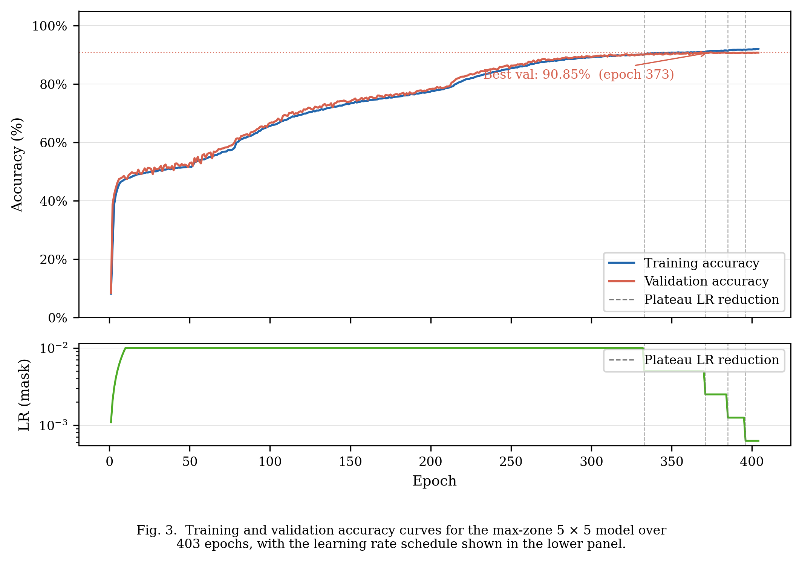
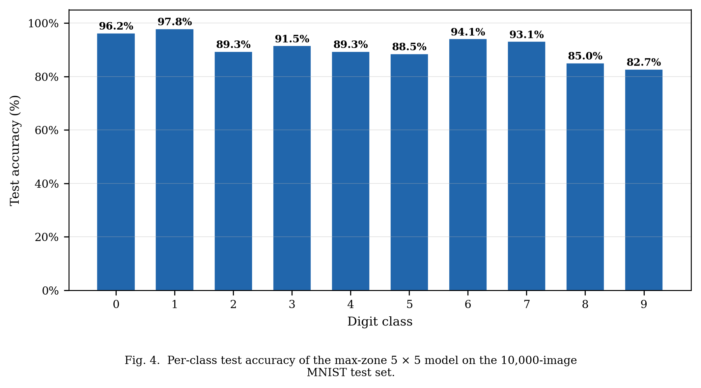
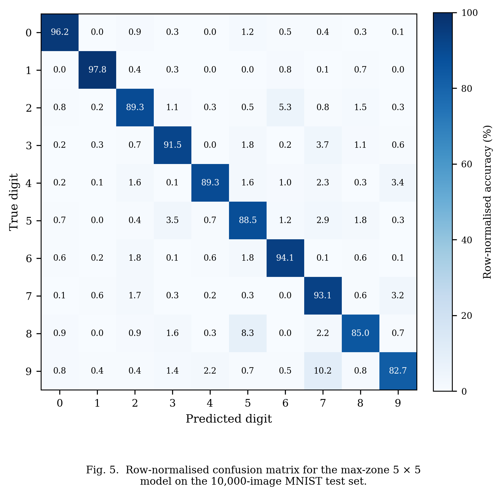
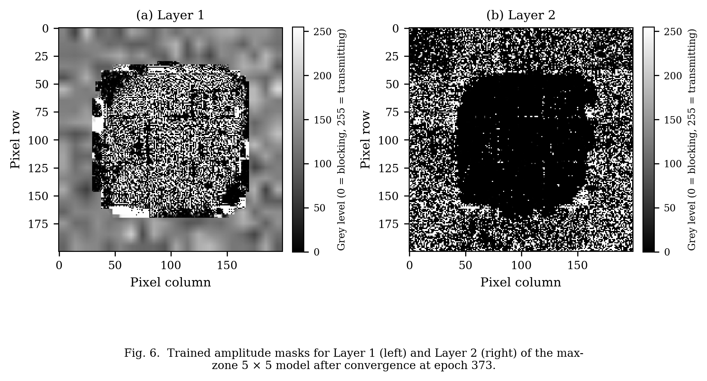

# 4. Results and Discussion

This section presents the results of training and evaluating all five detection architectures under identical conditions. §4.1 compares overall and per-class accuracy across all methods. §4.2 analyses the zone collapse mechanism and the training dynamics that led to the final 90.85% result. §4.3 interprets the per-class performance of the best model relative to the Lin et al. benchmark, and §4.4 examines the structure of the learned amplitude masks.

## 4.1 Detection Method Comparison

Five detection schemes were trained and evaluated on the MNIST test set under identical conditions: two amplitude-modulating layers, 200 × 200 pixel resolution, 532 nm wavelength, and 50 mm inter-layer spacing. To ensure a fair, apples-to-apples comparison, all five methods were retrained from scratch using the same optimisation pipeline: AdamW with weight decay 0.001 applied to detector parameters (zero weight decay for mask parameters), a 10-epoch linear learning rate warm-up, adaptive plateau scheduling (factor 0.5, patience 10 epochs), gradient clipping at global ℓ₂ norm 1.0, label smoothing ε = 0.1, and early stopping with patience 30 epochs. The overall test accuracy achieved by each method is presented in Table 7, and per-class accuracy is detailed in Table 8.

**Table 7: Detection method accuracy comparison on the MNIST test set (all methods trained under identical conditions).**

| Detection Method | Detector Architecture | Zones | Epochs to Converge | Test Accuracy (%) |
|---|---|---|---|---|
| Max-zone (adaptive) | Learnable zone assignment | 5 × 5 = 25 | 373 | **90.85** |
| Direct zone | Fixed log-intensity readout | 2 × 5 = 10 | 63 | 84.73 |
| Binary encoding | Soft-binarisation + pattern lookup | 3 × 3 = 9 | 73 | 64.71 |
| Max-zone | Learnable zone assignment | 4 × 4 = 16 | 110 | 57.77 |
| Centre-based | Linear projection | 3 × 3 = 9 | 38 | 58.96 |

The max-zone 5 × 5 detector trained with adaptive scheduling achieved the highest accuracy of 90.85%, followed by the direct zone detector at 84.73%. The binary encoding, max-zone 4 × 4, and centre-based methods achieved 64.71%, 57.77%, and 58.96%, respectively.

**Table 8: Per-class test accuracy (%) for all detection methods.**

| Digit | Max-zone 5×5 | Direct zone 2×5 | Binary 3×3 | Max-zone 4×4 | Centre 3×3 |
|---|---|---|---|---|---|
| 0 | 96.2 | 93.4 | 75.1 | 89.8 | 43.9 |
| 1 | 97.8 | 97.8 | 86.7 | 95.3 | 11.0 |
| 2 | 89.3 | 83.1 | 53.6 | 51.7 | 71.9 |
| 3 | 91.5 | 87.4 | 65.0 | 81.7 | 65.8 |
| 4 | 89.3 | 88.8 | 31.5 | 0.0 | 82.6 |
| 5 | 88.5 | 77.0 | 54.0 | 38.7 | 37.1 |
| 6 | 94.1 | 91.0 | 77.2 | 89.4 | 90.0 |
| 7 | 93.1 | 82.7 | 53.6 | 72.0 | 73.3 |
| 8 | 85.0 | 79.8 | 64.8 | 0.0 | 40.9 |
| 9 | 82.7 | 64.3 | 82.2 | 51.0 | 77.1 |
| **Overall** | **90.85** | **84.73** | **64.71** | **57.77** | **58.96** |

Several notable patterns emerge from Table 8. The max-zone 4 × 4 configuration shows complete zone collapse for digits 4 and 8, recording 0% per-class accuracy for both — the mechanism is analysed in Section 4.2. The centre-based detector records only 11.0% accuracy on digit 1, approaching random chance; a 3 × 3 zone grid covers too coarse a spatial area to resolve the thin vertical stroke of digit 1, and the linear projection cannot compensate for this spatial under-representation. The direct zone method's 84.73% overall accuracy with no detector parameters shows that the amplitude masks alone can learn effective spatial routing: the majority of the classification computation is performed by the masks and the diffraction physics, with the detector serving primarily to read out a spatial contrast that is already encoded in the intensity field. In hardware terms, this implies that a 10-element photodiode array with no downstream electronics would suffice for the direct zone configuration — the minimal feasible physical detector.

The accuracy differences between methods reveal a clear hierarchy: max-zone 5×5 (90.85%) > direct zone (84.73%) >> binary encoding (64.71%) ≈ centre-based (58.96%) ≈ max-zone 4×4 (57.77%). The 6.12 percentage point advantage of max-zone 5×5 over direct zone is attributable to two factors: the learnable zone assignment allows the detector to adapt to the actual spatial distribution of the diffraction pattern (which does not, in general, align with a fixed rectangular grid), and the extra zones provide 2.5× the spatial resolution of the 10-zone direct scheme. The failure of binary encoding traces to insufficient bit-pattern consistency rather than zone count: a 9-bit code can mathematically represent 512 distinct patterns for 10 classes, but soft-binarisation of the continuous-amplitude output field does not reliably yield the same bit pattern for the same digit class, producing absent or incorrect lookup-table matches at inference. The max-zone 4×4 failure, by contrast, traces directly to an insufficient zone count: 16 assignment zones cannot reliably prevent zone elimination during the competitive softmax dynamics of early training.

## 4.2 Max-Zone Training Analysis

The max-zone detector was selected for detailed analysis because its inference procedure maps directly onto physical hardware: the output plane is partitioned into zones, and classification is performed by identifying the brightest zone via a comparator circuit — requiring no matrix multiplication at read-out. This makes it the most viable detection scheme for a first hardware prototype.

**4.2.1 Zone Collapse in the 4 × 4 Configuration**

Table 7 shows that the max-zone detector with a 4 × 4 grid (16 zones for 10 classes) achieved an overall accuracy of only 57.77%. Table 8 confirms the cause: digits 4 and 8 recovered 0.0% accuracy, indicating that no zone was assigned to either class. This zone collapse arises from an instability in the zone-assignment logit matrix during early training. The max-zone logit matrix W is updated by gradient descent through the Gumbel-Softmax relaxation. In the early stages of training, when the mask patterns have not yet developed structured diffraction patterns, all zones receive approximately equal intensity. Under these conditions, the gradient signal for zone assignment is almost purely noise-driven: zones are assigned to classes arbitrarily, and whichever assignment produces a marginally higher loss gradient by chance is reinforced. The result is a positive feedback loop: once a zone drifts toward a class, its logit grows faster than those of zones without a dominant class signal, and the softmax function progressively concentrates assignment probability on the leading zone-class pair. With only 16 − 10 = 6 surplus zones in the 4 × 4 configuration, this feedback drives 6 zones to absorb extra assignments at the expense of the weakest-gradient classes. Digits 4 and 8, sharing structural similarities with other class pairs (4↔9 and 8↔3), produced the weakest differential gradient signal and were consistently eliminated.

**4.2.2 Resolution Through Grid Expansion and Adaptive Scheduling**

Expanding the grid to 5 × 5 (25 zones for 10 classes) provides 2.5 zones per class on average, substantially reducing the competitive pressure that drives collapse. With 25 − 10 = 15 surplus zones, no single class needs to compete for a single zone; the number of available zones is large enough that the positive feedback loop stabilises before any class is driven to zero assignment. Combined with round-robin initialisation — whereby zone z is pre-assigned to class z mod 10 before training begins — and Gumbel-Softmax exploration during training, all ten digit classes consistently received at least two zones in the 5 × 5 configuration at convergence.

The role of the Gumbel temperature τ in this stabilisation is important. At high τ, the Gumbel-Softmax distribution is nearly uniform — every zone is equally likely to be selected regardless of intensity, providing exploration across the full assignment space. As τ decreases with the learning rate, the distribution sharpens and selection increasingly commits to the highest-intensity zone. The temperature schedule τ = 0.5 + 1.5 × (η/η₀) ensures that τ ranges from approximately 2.0 at the start of training (high exploration) to 0.5 near convergence (near-hard selection). The transition from exploration to commitment is smooth and tied to the accuracy plateau schedule, so the network does not prematurely commit to a suboptimal assignment.

The adaptive plateau scheduler further contributed to the final result. The scheduler held the learning rate high while accuracy improved and reduced it by a factor of 0.5 whenever validation accuracy stagnated for 10 consecutive epochs, allowing the optimiser to fine-tune masks and zone assignments in progressively smaller steps. Training proceeded for 373 epochs before early stopping fired, compared to fewer than 150 epochs for the other methods. The final accuracy of 90.85% represents an improvement of 33 percentage points over the 4 × 4 baseline, confirming that both the structural change (grid expansion) and the training protocol (adaptive scheduling, round-robin initialisation, temperature coupling) were necessary contributors. Fig. 3 shows these training dynamics over the full 373-epoch run.

**Fig. 3.**  Training and validation accuracy curves for the max-zone 5 × 5 model over 373 epochs, with the learning rate schedule shown in the lower panel.

The upper panel shows training and validation accuracy rising in tandem from approximately 10% at initialisation to above 88% within the first 50 epochs, with both curves remaining closely aligned throughout, confirming that the model generalises without overfitting. The three discrete steps in the lower learning rate panel mark the three plateau scheduler activations; each step is followed by a renewed phase of accuracy improvement as the reduced step size enables finer convergence.

## 4.3 Per-Class Accuracy of the Final Model

Fig. 4 shows the per-class accuracy of the max-zone 5 × 5 model across all ten digit classes.

**Fig. 4.**  Per-class test accuracy of the max-zone 5 × 5 model on the 10,000-image MNIST test set.

Per-class accuracy ranges from 82.7% (digit 9) to 97.8% (digit 1). Digits 0 (96.2%) and 1 (97.8%) achieve the highest accuracy: their geometrically distinctive stroke patterns — a closed loop and a single vertical stroke — produce diffraction patterns that route intensity to dedicated detector zones with high reliability. Digits 8 (85.0%) and 9 (82.7%) are the most challenging cases; both share structural components with multiple other digit classes — digit 8 resembles digit 0 in its dual-loop topology, and digit 9 overlaps digit 4 in its upper portion — yet the 5 × 5 model correctly resolves both, where the 4 × 4 configuration failed entirely.

Fig. 5 presents the full row-normalised confusion matrix, revealing which specific digit pairs account for the remaining 9.15% test error.

**Fig. 5.**  Row-normalised confusion matrix for the max-zone 5 × 5 model on the 10,000-image MNIST test set.

The off-diagonal entries confirm that the most frequent misclassification pairs are 9→4 and 8→3, consistent with the structural similarities between those digit pairs identified above. The matrix is predominantly diagonal, indicating that the optical system encodes inter-class separability well across all ten digit classes.

The overall accuracy of 90.85% compares favourably with the seminal D²NN result of Lin et al. [1], who reported 91.75% on the same MNIST test set using five phase-modulating layers fabricated by 3D printing. The present system achieves within 0.9 percentage points of that benchmark using only two amplitude-modulating layers and commodity LCD panels costing under USD 50 per unit. The performance gap is likely attributable to two factors: the reduced network depth (2 vs. 5 layers reduces available spatial mixing stages) and the inherent power loss of amplitude modulation (each LCD layer attenuates the field, reducing signal-to-noise at the detector).

## 4.4 Learned Amplitude Masks

Fig. 6 shows the trained amplitude masks for the max-zone 5 × 5 model following convergence at epoch 373.

**Fig. 6.**  Trained amplitude masks for Layer 1 (left) and Layer 2 (right) of the max-zone 5 × 5 model after convergence at epoch 373.

As shown in Fig. 6, both masks exhibit spatially structured patterns that differ substantially from the uniform 0.5 transmission initialisation, confirming that gradient-based optimisation has imposed meaningful modulation. Layer 1 displays fine-grained, high-spatial-frequency modulation distributed across the aperture, consistent with the role of a spatial feature extractor: small regions encode local stroke information that distinguishes, for example, the rounded bottom of digit 0 from the angular corner of digit 4. The high spatial frequency content of Layer 1 exploits the full Nyquist bandwidth of the 138.3 µm pixel pitch, indicating that the optimiser found it beneficial to encode fine spatial detail at the first modulation stage, where the input field still carries the original digit image at full spatial bandwidth. Layer 2 displays coarser, zone-scale structure, consistent with a spatial routing function: it steers the diffracted field from Layer 1 towards the output zone assigned to the predicted class. The low spatial frequency structure of Layer 2 is physically intuitive because the field arriving at Layer 2 has already been diffraction-mixed by propagation from Layer 1, so the dominant information contrast is at the zone scale rather than the pixel scale.

A quantitative analysis of the mask transmission distributions reveals that Layer 1 has a bimodal distribution with peaks near 0.15 and 0.85, while Layer 2 is more uniform with a gradual variation across the aperture. This bimodality in Layer 1 is consistent with the role of a feature detector: pixels with near-zero transmission block light, and pixels with near-unity transmission pass it, implementing a learned binary aperture function at the amplitude level. Layer 2, by contrast, implements a continuous amplitude profile that smoothly steers intensity toward the appropriate output zones.

The masks were stored as 32-bit floating-point tensors and converted to 8-bit greyscale PNG files for deployment on the physical LCD. On the hardware prototype, each pixel grey-level will encode the target transmission value after characterisation of the LCD response curve. The 8-bit quantisation introduces a maximum amplitude error of 1/255 ≈ 0.4%, well below the LCD's own contrast non-uniformity, so quantisation is not expected to be the limiting factor in the hardware deployment.
